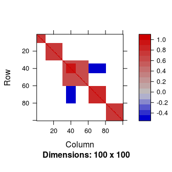
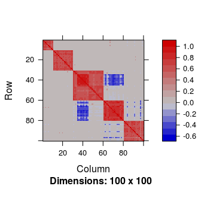
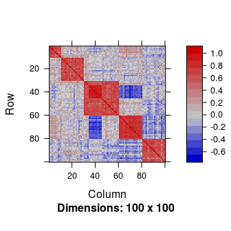
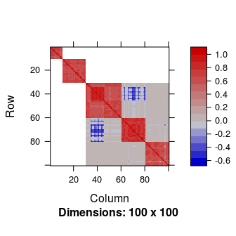
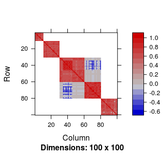
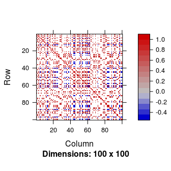
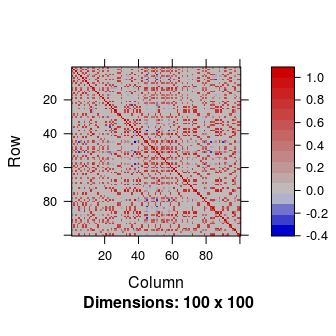
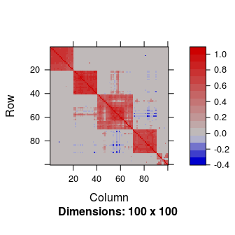
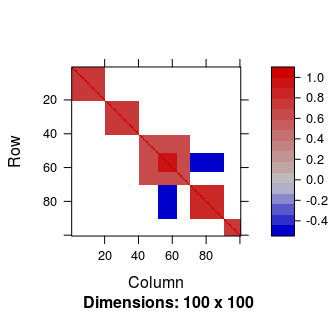
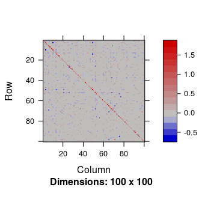

Installation
============

    devtools::install_github("Marie-PerrotDockes/BlockCov")

Introduction
============

This package implements the algorithm proposed by Perrot-Dockès,
Lévy-Leduc, and Rajjou (2019). For further details we refer the reader
to this paper. We shall consider the following framework. Let
**E**1, **E**2, ⋯, **E***n*, *n*
zero-mean i.i.d. *q*-dimensional random vectors having a covariance
matrix **Σ** such that the number *q* of its rows and columns is much
larger than *n*. The goal of the package is to propose a new estimator
of **Σ** and of the square root of its inverse in the particular case
where **Σ** is assumed to have a block structure without limiting
ourselves to diagonal blocks. More precisely, in this paper, we shall
assume that

**Σ** = **Z** **Z**′+**D**,

where **Z** is a *q* × *k* sparse matrix with *k* ≪ *q*, **Z**′ denotes
the transpose of the matrix **Z** and **D** is a diagonal matrix such
that the diagonal terms of **Σ** are equal to one.

Our approach consists in providing a low rank matrix approximation of
the **Z** **Z**′ part of **Σ** and then in using a ℓ1
regularization in order to obtain a sparse estimator of **Σ**. More
precisely, since **Σ** is a correlation matrix, it is a symmetric matrix
with ones on its diagonal, thus all the information is contained in its
upper triangular part without its diagonal. If we know **P** the
(*q* − 1)×(*q* − 1) symmetric matrix, which has for upper triangular
part the upper triangular part of **Σ** without its diagonal, we know
**Σ**. The matrix **P** has the advantage to have a low rank. In the
following, we propose to first estimate the block matrix **P**.

We shall moreover propose a methodology to estimate **Σ** in the case
where the block structure is latent that is when the columns and rows of
**Σ** have to be permuted according to an unknown permutation in order
to make the block structure appear. In this case, a hierarchical
clustering step has to be applied beforehand.

Simulation of **Σ** having a block structure
============================================

In order to generate a matrix **Σ** having a block structure with
extra-diagonal blocks and *q* = 100, we can use the function as follows:

    q <- 100
    Sigma <- Simu_Sigma(q = q, diag = FALSE, equal = TRUE)

The matrix **Σ** is displayed in Figure .

Using the matrix **Σ** generated by the function a *n* × *q* matrix
**E** was generated such that its rows are independent zero-mean
Gaussian random vectors having a covariance matrix equal to **Σ** and
*n* = 30.

    n <- 30
    E <- matrix(rnorm(n * q), ncol = q) %*% chol(as.matrix(Sigma))

Estimation of **Σ** (without estimating and **Σ**−1/2)
=================================================================

Estimation of **Σ** when the parameters are known
-------------------------------------------------

In order to get an estimator of **Σ** the function was applied. Since
the data set was simulated, the rank of **P**, the sub-matrix of **Σ**,
and its number of non null values are known.

    k <- 5
    nb_nn0 <- sum(Sigma[upper.tri(Sigma, diag = FALSE)] != 0)
    res_known <-  Sigma_estimation(E, k = k, nb_nn0 = nb_nn0)

Our estimator
*h**a**t***Σ**
hat**Σ**
 of **Σ** is given by . It is displayed in Figure and is obtained by
using:

    Matrix::image(res_known$Sigma_est)

The Frobenius norm
$\\|\\boldsymbol{\\Sigma}-\\hat{\\boldsymbol{\\Sigma}}\\|$ is equal to
5.5.

For comparison purpose, the sample correlation matrix is displayed in
Figure .

    Matrix::image(Matrix::Matrix(cor(E)))

The Frobenius norm
$\\|\\boldsymbol{\\Sigma}-\\hat{\\boldsymbol{\\Sigma}}\_{\\textrm{emp}}\\|$
is equal to 14.5, where $\\hat{\\boldsymbol{\\Sigma}}\_{\\textrm{emp}}$
denotes the sample correlation matrix.

Estimation of **Σ** when the parameters are unknown
---------------------------------------------------

In practice, the number of non null values and the rank of **P** are
unknown. These parameters can be both estimated using the function .

For choosing the rank of **P**, two strategies are available in the
package and compared in Perrot-Dockès, Lévy-Leduc, and Rajjou (2019):

-   The first strategy is the criterion based on the Cattell's scree
    plot described in Cattell (1966). In the package, it can be used by
    setting in the function.
-   The second strategy is the permutation method proposed by
    Horn (1965). In the package, it can be used by setting in the
    function.

To choose the number of non null values two methodologies are also
available in the package and compared in Perrot-Dockès, Lévy-Leduc, and
Rajjou (2019):

-   The method described in Perrot-Dockès, Lévy-Leduc, and
    Rajjou (2019). In the package, it can be used by setting in function
    and
-   the approach proposed in Bickel and Levina (2008) based on
    cross-validation. In the package, it can be used by setting in the
    function.

For example, an estimator of **Σ** using the criterion and the method
can be obtained by using the function as follows:

    res <-Sigma_estimation(E, method_k = "Cattell", method_0 = "Elbow")

It has to be noticed that "Cattell" and "Elbow" are the default value
for and respectively. Hence, the same result can be obtain by using :

    res <-Sigma_estimation(E)

The corresponding estimator of **Σ** is displayed in Figure . The
estimated rank and the estimated number of non null values can be
obtained by and , respectively. Here, the estimated rank is equal to 5
and the estimated number of non null values is 1155. Note that the true
values of these parameters are 5 and 1270.

An estimator of **Σ** using the criterion and the method can be obtained
by using the function as follows:

    res_pabl <- Sigma_estimation(E, method_k = "PA", method_0 = "BL")

The corresponding estimator of **Σ** is displayed in Figure . Here, the
estimated rank is equal to 5 and the estimated number of non null values
is 1146.

This second approach is a little bit slower than the first one
especially for large values of *q* but can be more accurate when the
number of samples is large enough, see Perrot-Dockès, Lévy-Leduc, and
Rajjou (2019) for further details on the numerical and statistical
performance of the different strategies.

    Matrix::image(res$Sigma_est)

    Matrix::image(res_pabl$Sigma_est)

We can see from this figure that the estimation of **Σ** does not seem
to be altered by having to estimate the number of non null values and
the rank of the matrix. The Frobenius norm
$\\|\\boldsymbol{\\Sigma}-\\hat{\\boldsymbol{\\Sigma}}\\|$ is equal to
7.1 for the first estimator and to 7.3 for the second one.

Estimator of **Σ**−1/2 obtained from an estimator of **Σ**
=====================================================================

An estimator of **Σ**−1/2 can be obtained using the function
by setting the arguments to true as follows:

    res_both <- Sigma_estimation(E, method_k = "Cattell", method_0 = "Elbow", inv_12 = TRUE)

An estimator of **Σ** is obtained with and an estimator of
**Σ**−1/2 is obtained with . It can be used to remove the
dependence that may exist between the columns of **E**.

Estimation of **Σ** and **Σ**−1/2 when the block structure is latent
===============================================================================

In practice, it is possible that the block structure of **Σ** only
appears after having permuted its rows and columns according to a well
chosen permutation. We explain hereafter how to estimate **Σ** and
**Σ**−1/2 in this case. We first generate such a matrix by
applying a random permutation to the rows and columns of the matrix
**Σ** previously generated.

    samp <- sample(1:q, q, replace = FALSE)
    Sigma_samp <- Sigma[samp, samp]

The corresponding matrix is displayed in Figure .

    Matrix::image(Sigma_samp)

In such a situation where the columns and rows have to be permuted
according to an unknown permutation, we propose to use a hierarchical
clustering as the first step of our methodology and then use the same
strategy. This is performed by putting in the arguments of the function
.

    E <- matrix(rnorm(n * q), ncol = q) %*% chol(as.matrix(Sigma_samp))
    res_samp <- Sigma_estimation(E, reorder = TRUE, inv_12 = TRUE)

The estimated matrix is displayed in Figure .

    Matrix::image(res_samp$Sigma_est)

The permutation to make the block structure appear is available from .
The corresponding estimated correlation matrix in which the columns have
been permuted in order to make the block structure appear is obtained
using the following lines and is displayed in Figure :

    ord <- res_samp$order
    Matrix::image(res_samp$Sigma_est[ord, ord])

This matrix has to be compared with the following one displayed in
Figure :

    Matrix::image(Sigma_samp[ord, ord])

Once again, our strategy does not seem to be altered by the permutation
of the columns of the original matrix **Σ**. The Frobenius norm of the
error is equal to 12.4.

In this situation $\\hat{\\boldsymbol{\\Sigma}}^{-1/2}$ is still
available. The matrix
$\\hat{\\boldsymbol{\\Sigma}}^{-1/2}\\boldsymbol{\\Sigma}\\hat{\\boldsymbol{\\Sigma}}^{-1/2}$,
which is displayed in Figure , should be close to the identity matrix:

    Matrix::image(res_samp$S_inv_12 %*% Sigma_samp %*%res_samp$S_inv_12)

The associated Frobenius norm
$||\\hat{\\boldsymbol{\\Sigma}}^{-1/2}\\boldsymbol{\\Sigma}\\hat{\\boldsymbol{\\Sigma}}^{-1/2}-\\textrm{Id}\_q||=$
7.8.

All the values of the Frobenius norms are quite close meaning that our
methodology is efficient even when the parameters are unknown and when
the columns and rows have to be permuted in order to make the block
structure appear.

References
==========

Bickel, Peter J., and Elizaveta Levina. 2008. “Covariance Regularization
by Thresholding.” *Ann. Statist.* 36 (6). The Institute of Mathematical
Statistics: 2577–2604.
doi:[10.1214/08-AOS600](https://doi.org/10.1214/08-AOS600).

Cattell, R. B. 1966. “The Scree Test for the Number of Factors.”
*Multivariate Behavioral Research* 1 (2): 245–76.

Horn, John L. 1965. “A Rationale and Test for the Number of Factors in
Factor Analysis.” *Psychometrika* 30 (2): 179–85.
doi:[10.1007/BF02289447](https://doi.org/10.1007/BF02289447).

Perrot-Dockès, M., C. Lévy-Leduc, and L. Rajjou. 2019. “Estimation of
Large Block Covariance Matrices: Application to ‘Multi-Omic’ Approaches
to Study Seed Quality.”
